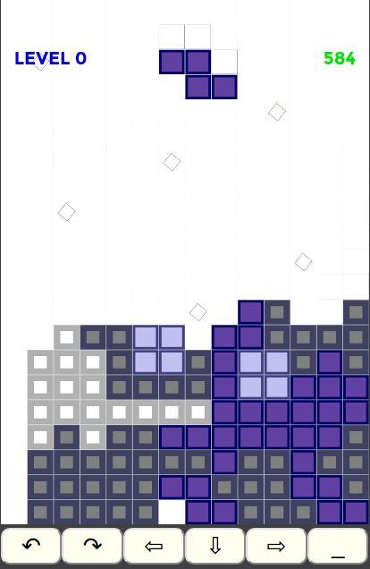

# Js-tetris
Tetris implementations in ES5 javascript.

Supported **input methods** are keyboard (pc-traditional)
and mouse/touch in two simple variants (hint: try hitting
  at different places on the game area).

Each game is **distributed** in its own .html file, like the [traditional tetris](tetris.html)
and a [hedging variant](hedge.html).

Currently you can **try these out online** in firebase dev deployment environment:

- [Tetris](https://tetris-2df9b.firebaseapp.com/tetris.html)

- [Hedge tetris](https://tetris-2df9b.firebaseapp.com/hedge.html)

